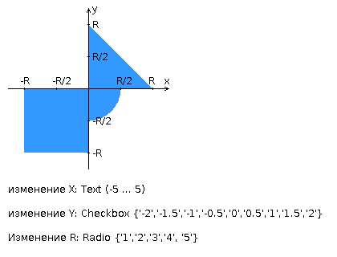

# Лабораторная работа #1

## Разработанная HTML-страница должна удовлетворять следующим требованиям:

- Для расположения текстовых и графических элементов необходимо использовать блочную верстку.
- Данные формы должны передаваться на обработку посредством GET-запроса.
- Таблицы стилей должны располагаться в самом веб-документе.
- При работе с CSS должно быть продемонстрировано использование селекторов псевдоэлементов, селекторов классов, селекторов дочерних элементов, селекторов потомств а также такие свойства стилей CSS, как наследование и каскадирование.
- HTML-страница должна иметь "шапку", содержащую ФИО студента, номер группы и номер варианта. При оформлении шапки необходимо явным образом задать шрифт (fantasy), его цвет и размер в каскадной таблице стилей.
- Отступы элементов ввода должны задаваться в процентах.
- Страница должна содержать сценарий на языке JavaScript, осуществляющий валидацию значений, вводимых пользователем в поля формы. Любые некорректные значения (например, буквы в координатах точки или отрицательный радиус) должны блокироваться.

1
